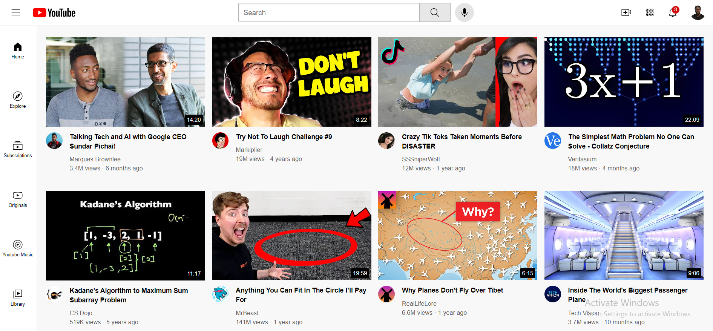
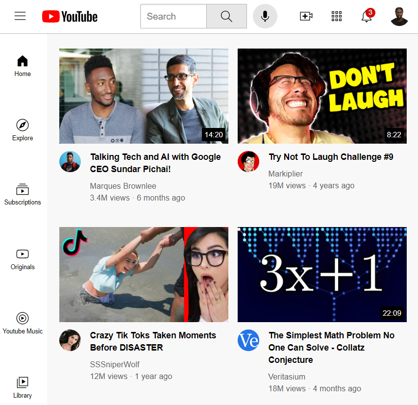

# YouTube Clone

This project is a simple YouTube clone created with HTML and CSS. It includes a header, sidebar, and a responsive video grid displaying video previews.

## Table of Contents

- [Features](#features)
- [Screenshots](#screenshots)
- [Customization](#customization)

## Features

- **Header**: A fixed header with a YouTube logo, search bar, navigation links, and user icons.
- **Sidebar**: A fixed sidebar with navigation links for Home, Explore, Subscriptions, and more.
- **Video Grid**: A responsive grid layout showcasing video previews with thumbnails, titles, authors, and view counts.
- **Tooltip**: Hover effects with tooltips for buttons such as search, voice search, upload, and notifications.

## Screenshots




## Customization

- **CSS Files**: Explore and modify individual CSS files for different sections of the clone.
  - `header.css`: Styling for the fixed header.
  - `sidebar.css`: Styling for the fixed sidebar.
  - `video.css`: Styling for the video grid.
  - `general.css`: General styling for paragraphs and the body.
- **Responsive Design**: The project includes media queries for responsiveness. Adjust as needed for various screen sizes.

```css
/* Example of a media query in video.css */
@media (max-width: 750px) {
  .video-grid {
    grid-template-columns: 1fr 1fr;
  }
}
```
